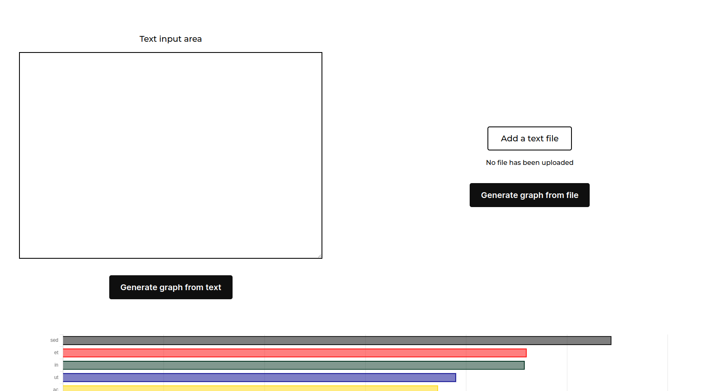

## Histogram App

> This is a simple Histogram application that allows users to generate grahp bars based on the count of words of either a text file or a text area  

## Screenshot



### Requirements
In order to work on this project, you need to have the following dependencies installed: 

- [Ruby](https://www.ruby-lang.org/en/) 
- [Postgresql](https://www.postgresql.org/)
- [Node.js](https://nodejs.org/en/)
- [Yarn](https://yarnpkg.com/)
- [Rails](https://rubyonrails.org/)

## Built With

- Languages: _**Ruby**_
- Frameworks: _**Ruby On Rails**_
- Technologies used: _**Visual Studio Code**_

## Getting Started

### Clone this repository

```bash
$ git clone git@github.com:JohnFTitor/histogram.git
$ cd histogram
```

### Commands to run

Run 
```bash
$ bundle install 
```

To get all the gems required for the project

Then, run

```bash
$ npm install 
```
To install packages such esbuild and chartkirt

To check linters locally, use
```bash
$ rubocop .
```

Once you have the project correctly set up, run 
```bash
$ bin/rails db:create
```

To generate the database for this project and work without any issue. Please review the requirements listed above   

Important note: Since this project uses SCSS for the styling, you need to run: 

```bash
$ ./bin/dev
```

For you to see the styling being applied in the browser during development

It's really important to check the console where you run bin/dev, since it is there where the values of the cycles will be printed

If you have any issue setting up this project, don't hesitate to contact me with any link below

## Next Steps

- Optimizing the counting algorithm. There must be a better way to count the words and sort them on the go, without demanding too much time complexity
- Add exception handling with direct user feedback. The app can be easily broken if you submit a file that is not of type .txt or no file at all, which is not suitable. Providing error handling and flash messages can do so the users have a better experience
- Create a better chart. Due to the nature of the external gem, there are some issues when the input file has many unique words, since its size is not responsive at all. Creating a chart by hand could provide more flexibility on this end

## Authors

:bust_in_silhouette: **Andrés Felipe Arroyave Naranjo**

 Platform | Badge |
 --- | --- |
 **PortFolio**    | [JohnFTitor](https://johnftitor.me/)
 **GitHub**    | [@JohnFTitor](https://github.com/JohnFTitor)
 **Twitter**   | [@johnftitor](https://twitter.com/johnftitor)
 **LinkedIn**  | [Andres](https://www.linkedin.com/in/andresarroyavenaranjo/?locale=en_US)

## 🤝 Contributing

Contributions, issues, and feature requests are welcome!

## Show your support

Give a ⭐️ if you like this project!
